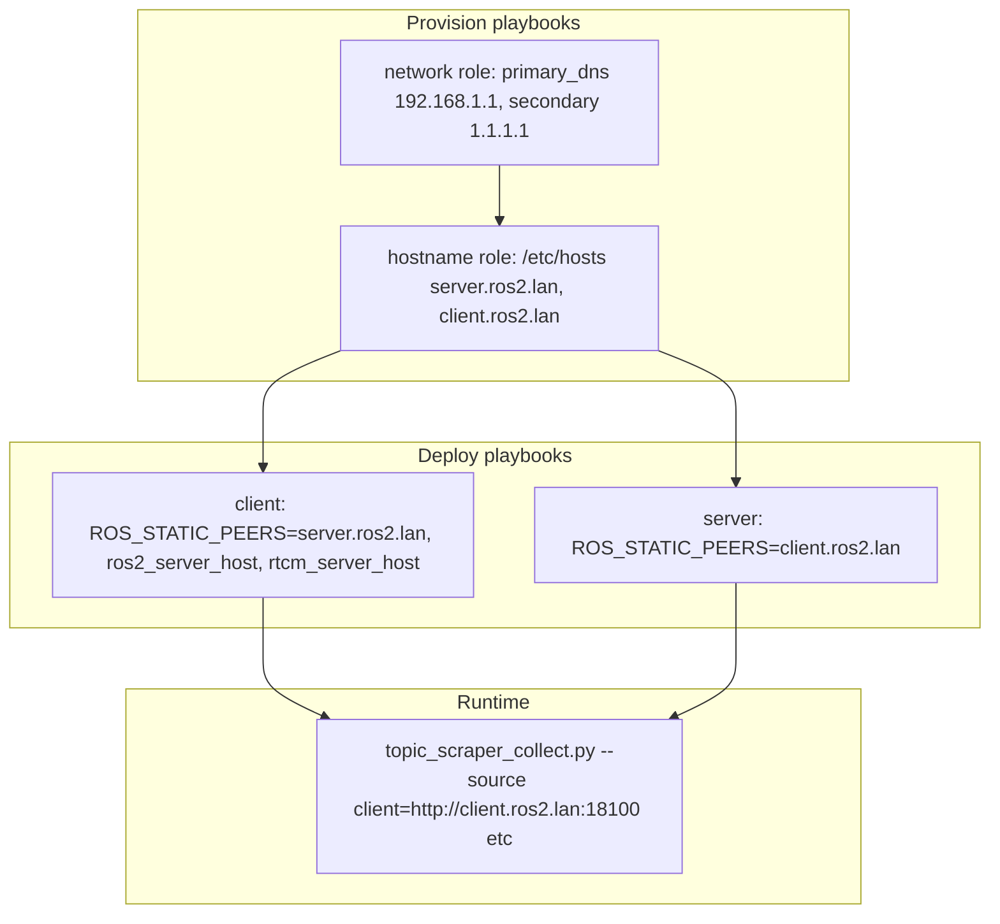

# DNS Override and ROS2 Hostname Migration Plan

## 1. DNS system servers (Ansible)

Extend the existing **network** role to support `primary_dns_server` and `secondary_dns_server` variables, deriving `network_nameservers` when set.

**Approach:** Add logic in the network role (or in group_vars) so that when `primary_dns_server` and `secondary_dns_server` are defined, they populate `network_nameservers`. The netplan template already consumes `network_nameservers` (see [ansible/roles/network/templates/netplan.yaml.j2](ansible/roles/network/templates/netplan.yaml.j2)), so no template changes are needed if we set the list correctly.

**Option A (recommended):** Add a `set_fact` task in [ansible/roles/network/tasks/main.yml](ansible/roles/network/tasks/main.yml) before the template:

```yaml
- name: Set network_nameservers from primary/secondary when provided
  ansible.builtin.set_fact:
    network_nameservers: "{{ [primary_dns_server, secondary_dns_server] }}"
  when:
    - primary_dns_server is defined and primary_dns_server | length > 0
    - secondary_dns_server is defined and secondary_dns_server | length > 0
```

**Option B:** Set `network_nameservers` directly in group_vars (simpler; no role change):

```yaml
# In group_vars/client.yml and server.yml
primary_dns_server: "192.168.1.1"
secondary_dns_server: "1.1.1.1"
network_nameservers:
  - "{{ primary_dns_server }}"
  - "{{ secondary_dns_server }}"
```

**Files to change:**

- [ansible/group_vars/client.yml](ansible/group_vars/client.yml): Add `primary_dns_server`, `secondary_dns_server`, update `network_nameservers` (replace current `["1.1.1.1"]`)
- [ansible/group_vars/server.yml](ansible/group_vars/server.yml): Same

**Docker role:** The [docker](ansible/roles/docker/) role has `docker_dns_servers` (8.8.8.8, 8.8.4.4) for **containers**. Optionally align with system DNS by setting `docker_dns_servers` from the same vars in group_vars (e.g. `docker_dns_servers: [primary_dns_server, secondary_dns_server]`). The user asked specifically for "system" DNS; Docker DNS can remain separate unless you want consistency.

---

## 2. ROS2 hostnames (server.ros2.lan / client.ros2.lan)

### 2a. /etc/hosts for resolution

Both Pis must resolve `server.ros2.lan` and `client.ros2.lan`. Extend the **hostname** role or add a new task to manage `/etc/hosts` entries.

**Approach:** Add tasks to the hostname role (or a small `ros2_hosts` role) that append:

```
192.168.1.33 server.ros2.lan
192.168.1.34 client.ros2.lan
```

**Implementation:** New tasks in [ansible/roles/hostname/tasks/main.yml](ansible/roles/hostname/tasks/main.yml) or a dedicated role invoked from server/client playbooks:

```yaml
- name: Ensure ROS2 peer hostnames in /etc/hosts
  ansible.builtin.lineinfile:
    path: /etc/hosts
    line: "{{ item.ip }} {{ item.hostname }}"
    regexp: "^{{ item.ip }}\\s+{{ item.hostname }}\\s*$"
    state: present
  loop:
    - { ip: "192.168.1.33", hostname: "server.ros2.lan" }
    - { ip: "192.168.1.34", hostname: "client.ros2.lan" }
  become: true
```

Alternatively, use a variable `ros2_hosts_entries` in group_vars for flexibility.

### 2b. Central hostname variables

Add to [ansible/group_vars/all.yml](ansible/group_vars/all.yml):

```yaml
ros2_server_hostname: "server.ros2.lan"
ros2_client_hostname: "client.ros2.lan"
```

### 2c. Replace IPs with hostnames


| Location                                                                                 | Change                                                                                                                                                                                       |
| ---------------------------------------------------------------------------------------- | -------------------------------------------------------------------------------------------------------------------------------------------------------------------------------------------- |
| [ansible/group_vars/client.yml](ansible/group_vars/client.yml)                           | `ros2_server_host: "{{ ros2_server_hostname }}"`; `ROS_STATIC_PEERS={{ ros2_server_hostname }}` in master2master env; `rtcm_server_host: {{ ros2_server_hostname }}` in gps_rtk_rover config |
| [ansible/group_vars/server.yml](ansible/group_vars/server.yml)                           | `ROS_STATIC_PEERS={{ ros2_client_hostname }}` in feetech_servos env                                                                                                                          |
| [ansible/inventory](ansible/inventory)                                                   | `ansible_host=server.ros2.lan`, `ansible_host=client.ros2.lan` (see note below)                                                                                                              |
| [ansible/inventory.example](ansible/inventory.example)                                   | Same                                                                                                                                                                                         |
| [scripts/topic_scraper_collect.py](scripts/topic_scraper_collect.py)                     | Replace IPs in HELP_EPILOG examples (lines 26–82)                                                                                                                                            |
| [nodes/topic_scraper_api/README.md](nodes/topic_scraper_api/README.md)                   | Replace IPs in examples                                                                                                                                                                      |
| [.cursor/rules/servo-debug-telemetry.mdc](.cursor/rules/servo-debug-telemetry.mdc)       | Replace IPs in example                                                                                                                                                                       |
| [ansible/README.md](ansible/README.md)                                                   | Replace IPs in curl examples                                                                                                                                                                 |
| [scripts/README.md](scripts/README.md)                                                   | Update env var defaults and host references                                                                                                                                                  |
| [scripts/rtk_calibrate.sh](scripts/rtk_calibrate.sh)                                     | Default `RTK_SERVER_HOST` to `server.ros2.lan`                                                                                                                                               |
| [scripts/rtk_verify.sh](scripts/rtk_verify.sh)                                           | Defaults to `server.ros2.lan` / `client.ros2.lan`                                                                                                                                            |
| [scripts/rtk_status.sh](scripts/rtk_status.sh)                                           | Same                                                                                                                                                                                         |
| [scripts/joint_api_client.py](scripts/joint_api_client.py)                               | Docstring example                                                                                                                                                                            |
| [README.md](README.md)                                                                   | Server/Client section IPs                                                                                                                                                                    |
| [docs/diagrams/deployment.puml](docs/diagrams/deployment.puml)                           | Node labels (optional; could keep IPs for diagram clarity)                                                                                                                                   |
| [nodes/bridges/gps_rtk/tests/test_config.py](nodes/bridges/gps_rtk/tests/test_config.py) | `rtcm_server_host` in test data: use `"server.ros2.lan"` and update assertion                                                                                                                |


**ansible_host note:** If Ansible runs from a dev machine, it must resolve `server.ros2.lan` and `client.ros2.lan`. Options:

- Add to dev machine `/etc/hosts`: `192.168.1.33 server.ros2.lan`, `192.168.1.34 client.ros2.lan`
- Or keep `ansible_host` as IP and use hostnames only in ROS2 configs/scripts (simplest for bootstrap)

Recommendation: Use hostnames in inventory; document the dev-machine `/etc/hosts` requirement in [ansible/README.md](ansible/README.md).

---

## 3. Testing ROS2 nodes with topic_scraper_collect.py

After deploy, run from a host that can reach both Pis (e.g. dev machine with `/etc/hosts`, or from one of the Pis):

```bash
python scripts/topic_scraper_collect.py \
  --source client=http://client.ros2.lan:18100 \
  --source server=http://server.ros2.lan:18100 \
  --select '/leader/joint_states:.position' \
  --select '/follower/joint_states:.position' \
  --interval 0.1 \
  --once
```

**Validation checklist:**

- Topics return non-empty payloads (no timeouts/404)
- Values are not all zeros (e.g. `position` has non-zero entries when arms are connected)
- Both `client` and `server` sources emit data
- Save a short capture and inspect with `jq` for structure and non-zero values

**Suggested test matrix:**

- `/leader/joint_states` (server)
- `/follower/joint_states` (client)
- `/filter/input_joint_updates` (client)
- `/odom` or `/imu/data` if available
- `/server/gps/fix` and `/client/gps/fix` (expect zeros until RTK fix)

Document the test command and expected behavior in [scripts/README.md](scripts/README.md) or a short "Post-deploy verification" section.

---

## 4. Execution order and deployment

1. **Provision** (server.yml, client.yml) – applies network (DNS) and hostname (including /etc/hosts)
2. **Deploy** (deploy_nodes_client.yml, deploy_nodes_server.yml) – applies ROS2 configs with hostnames

If hostnames are added to inventory and the dev machine cannot resolve them, run provision first with IPs in inventory, then add `/etc/hosts` to the dev machine and switch inventory to hostnames for subsequent runs.

---

## 5. Mermaid overview




---

## 6. Summary of files to modify


| File                                                                                   | Changes                                                                                                                         |
| -------------------------------------------------------------------------------------- | ------------------------------------------------------------------------------------------------------------------------------- |
| `ansible/group_vars/client.yml`                                                        | primary_dns_server, secondary_dns_server, network_nameservers; ros2_server_host, ROS_STATIC_PEERS, rtcm_server_host → hostnames |
| `ansible/group_vars/server.yml`                                                        | primary_dns_server, secondary_dns_server, network_nameservers; ROS_STATIC_PEERS → hostname                                      |
| `ansible/group_vars/all.yml`                                                           | ros2_server_hostname, ros2_client_hostname                                                                                      |
| `ansible/roles/hostname/tasks/main.yml`                                                | Add /etc/hosts entries for server.ros2.lan, client.ros2.lan                                                                     |
| `ansible/inventory`, `inventory.example`                                               | ansible_host with hostnames (or keep IPs per choice above)                                                                      |
| `scripts/*.py`, `scripts/*.sh`                                                         | Replace IPs in defaults/examples                                                                                                |
| `nodes/topic_scraper_api/README.md`                                                    | Replace IPs in examples                                                                                                         |
| `nodes/bridges/gps_rtk/tests/test_config.py`                                           | rtcm_server_host to server.ros2.lan                                                                                             |
| `.cursor/rules/servo-debug-telemetry.mdc`                                              | Replace IPs                                                                                                                     |
| `ansible/README.md`, `README.md`, `scripts/README.md`, `docs/diagrams/deployment.puml` | Docs and diagram updates                                                                                                        |


