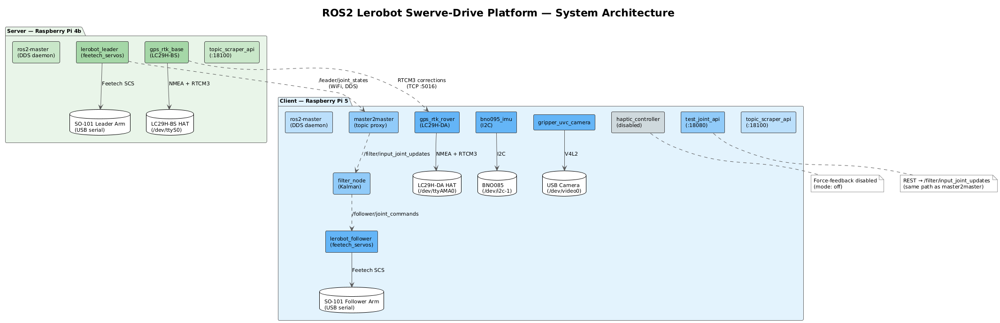
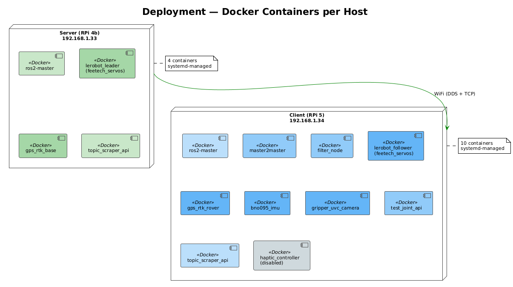
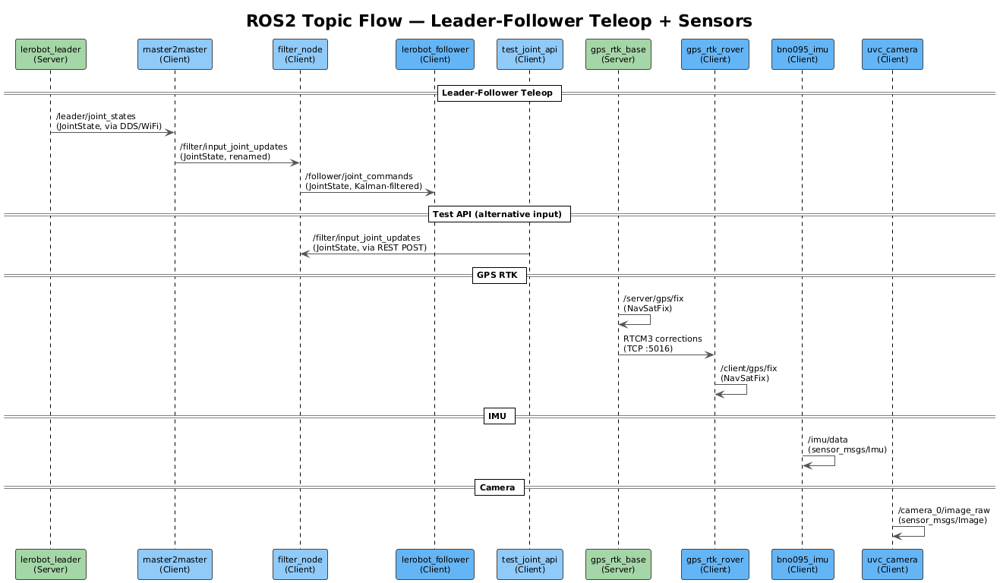

# ROS2 Lerobot Swerve-Drive Platform

A ROS2-based robotics platform with leader–follower teleop, RTK GPS, IMU, cameras, and swerve drive. Two Raspberry Pis (Server + Client) communicate over WiFi, each running Docker-containerized ROS2 nodes managed by Ansible and systemd.

## Architecture



<details>
<summary>Deployment view (containers per host)</summary>


</details>

<details>
<summary>Topic flow (message sequence)</summary>


</details>

PlantUML sources are in [`docs/diagrams/`](docs/diagrams/). Regenerate with:

```bash
./scripts/generate-diagrams.sh
```

## Implemented features

| Feature | Status | Description |
|---------|--------|-------------|
| Leader–follower teleop | **Working** | 6-DOF arm teleop: leader (Server) → master2master → Kalman filter → follower (Client) |
| GPS RTK positioning | **Working** | LC29H-BS base (Server) + LC29H-DA rover (Client), RTCM3 over TCP, `NavSatFix` topics, sub-meter accuracy |
| IMU | **Working** | BNO055 over I2C, `sensor_msgs/Imu` with Nav2 covariance matrices |
| USB cameras | **Disabled** | UVC camera bridge (present, `enabled: false` while camera unplugged) |
| Topic scraper API | **Working** | Dynamic ROS2 topic discovery + HTTP JSON API for runtime diagnostics |
| Haptic controller | **Disabled** | Force-feedback and zero-G hold for leader gripper (code present, `enabled: false`) |
| Swerve drive | **Working** | 4-wheel swerve: feetech bridge (8 servos) + controller (cmd_vel, FK/IK, odom) |
| RealSense D435i | **Working** | Depth + color + IMU (unified `/camera/imu`) via ros-jazzy-realsense2-camera |
| RPLidar-A1 | **Working** | 2D lidar `sensor_msgs/LaserScan` on `/scan` via ros-jazzy-rplidar-ros |
| Nav2 (MVP) | **Working** | 2D nav stack: odom, scan, IMU, goal → cmd_vel; EKF fuses odom+IMU |

## Node catalog

### Server (Raspberry Pi 4b — server.ros2.lan)

| Node | Type | ROS2 Topics | Hardware |
|------|------|-------------|----------|
| `ros2-master` | ros2_master | DDS daemon | — |
| `lerobot_leader` | feetech_servos | `/leader/joint_states` (pub) | SO-101 arm (USB serial) |
| `gps_rtk_base` | gps_rtk | `/server/gps/fix` (pub), RTCM3 TCP :5016 | LC29H-BS HAT (`/dev/ttyAMA0`) |
| `topic_scraper_api` | topic_scraper_api | HTTP :18100 | — |

### Client (Raspberry Pi 5 — client.ros2.lan)

| Node | Type | ROS2 Topics | Hardware |
|------|------|-------------|----------|
| `ros2-master` | ros2_master | DDS daemon | — |
| `master2master` | master2master | Proxies `/leader/joint_states` → `/filter/input_joint_updates` | — |
| `filter_node` | filter_node | `/filter/input_joint_updates` (sub) → `/follower/joint_commands` (pub) | — |
| `lerobot_follower` | feetech_servos | `/follower/joint_commands` (sub), `/follower/joint_states` (pub) | SO-101 arm (USB serial) |
| `gps_rtk_rover` | gps_rtk | `/client/gps/fix` (pub), RTCM3 from Server :5016 | LC29H-DA HAT (`/dev/ttyAMA0`) |
| `bno055_imu` | bno055_imu | `/imu/data` (pub, `sensor_msgs/Imu`) | BNO055 (`/dev/i2c-1`) |
| `gripper_uvc_camera` | uvc_camera | `/camera_0/image_compressed` (pub, `sensor_msgs/CompressedImage`) | USB camera |
| `swerve_drive_servos` | feetech_servos | `/swerve_drive/joint_states` (pub), `/swerve_drive/joint_commands` (sub) | 8× ST3215 (e.g. `/dev/ttyUSB1`) |
| `swerve_controller` | swerve_controller | `/cmd_vel` (sub), `/odom` (pub), `/swerve_drive/joint_commands` (pub) | — |
| `static_tf_publisher` | static_tf_publisher | TF base_link → imu_link, laser_frame | — |
| `robot_localization_ekf` | robot_localization_ekf | `/odom` (sub), `/imu/data` (sub), `/odometry/filtered` (pub) | — |
| `nav2_bringup` | nav2_bringup | `/cmd_vel` (pub), `/odom` or `/odometry/filtered`, `/scan`, `navigate_to_pose` (action) | — |
| `rplidar_a1` | rplidar_a1 | `/scan` (pub, `sensor_msgs/LaserScan`) | RPLidar A1 (`/dev/ttyUSB0`) |
| `realsense_d435i` | realsense_d435i | `/camera/*` (color, depth, pointcloud, `/camera/imu`) | RealSense D435i (USB 3.0) |
| `test_joint_api` | test_joint_api | REST :18080 → `/filter/input_joint_updates` (pub) | — |
| `topic_scraper_api` | topic_scraper_api | HTTP :18100 | — |
| `haptic_controller` | haptic_controller | Disabled (`mode: off`) | — |

### Topic flow (leader–follower path)

```
Server: lerobot_leader  →  /leader/joint_states
                              ↓ (WiFi / DDS)
Client: master2master   →  /filter/input_joint_updates  ← test_joint_api (REST)
                              ↓
        filter_node     →  /follower/joint_commands (Kalman-filtered)
                              ↓
        lerobot_follower → servos
```

### Topic flow (swerve + Nav2)

```
Nav2 (nav2_bringup)     →  /cmd_vel
                              ↓
        swerve_controller → /swerve_drive/joint_commands  →  swerve_drive_servos (8 servos)
        swerve_controller → /odom (and odom→base_link TF)
                              ↓
        robot_localization_ekf (optional) fuses /odom + /imu/data → /odometry/filtered
Nav2 reads: /odom or /odometry/filtered, /scan, /imu/data; goal via navigate_to_pose action.
```

## Hardware components

### Server — Raspberry Pi 4b

- Lerobot SO-101 leader arm (Feetech SCS servos, USB serial)
- GPS-RTK LC29H(BS) HAT with antenna

### Client — Raspberry Pi 5

- Lerobot SO-101 follower arm (Feetech SCS servos, USB serial)
- Swerve drive platform (4 × Feetech ST3215 pairs — wheel + steering)
- GPS-RTK LC29H(DA) HAT with antenna
- BNO055 IMU (I2C)
- RPLidar-A1 (USB)
- Intel RealSense D435i (USB)
- 2 × Arducam B0454 5MP OV5648 USB cameras

### Future

- AI offloading server (x64, LLM/VLA)

## Monorepo layout

```
├── nodes/                  All ROS2 node source + Dockerfiles
│   ├── ros2_master/        DDS daemon container
│   ├── master2master/      Cross-host topic proxy
│   ├── lerobot_teleop/     Leader→follower teleop (not deployed; path uses filter_node)
│   ├── filter_node/        Kalman filter for joint commands
│   ├── test_joint_api/     REST API for joint testing
│   ├── topic_scraper_api/  Dynamic topic scraper + HTTP API
│   ├── haptic_controller/  Force-feedback (disabled)
│   ├── swerve_drive_controller/ Swerve IK/FK, odometry, cmd_vel→joints
│   ├── static_tf_publisher/ Static TF base_link→sensors
│   ├── robot_localization_ekf/ EKF fuse odom+IMU
│   ├── nav2_bringup/       Nav2 navigation stack
│   ├── steamdeck_ui/       SteamDeck Electron UI + Python bridge (native, no Docker)
│   └── bridges/
│       ├── bno055_imu/     BNO055 IMU bridge
│       ├── feetech_servos/ Feetech servo bridge (leader + follower)
│       ├── uvc_camera/     UVC camera bridge
│       ├── gps_rtk/        GPS RTK bridge (base + rover)
│       ├── rplidar_a1/     RPLidar A1 LaserScan bridge
│       └── realsense_d435i/ RealSense D435i bridge
├── shared/                 Shared Python libraries
├── ansible/                Provisioning + deployment (Ansible)
│   ├── roles/              common, docker, network, hostname, ros2_node_deploy,
│   │                       ros2_node_verify, system_optimize, steamdeck_ui
│   ├── playbooks/          Provision + deploy + optimize
│   └── group_vars/         Per-host node lists and config
├── scripts/                Utility scripts (calibration, verification, diagnostics)
├── tests/                  Root-level tests
└── docs/diagrams/          PlantUML sources + generated PNGs
```

## Development setup

- **Python**: Managed with [mise](https://mise.jdx.dev/). Run `mise install` to get Python 3.12, uv, and Poetry.
- **Dependencies**: Root: `mise exec -- poetry install`. Each node has its own Poetry project.
- **Linters**: `poetry run poe lint` (root), `poetry run poe lint-nodes` (all nodes), `poetry run poe lint-ansible` (Ansible).
- **Tests**: `poetry run pytest` (root). Per-node: `cd nodes/<node> && poetry run poe test`.
- **Pre-commit**: `pre-commit install` once, then hooks run on every commit.

## Ansible

From the `ansible/` directory:

```bash
# Full site (provision + optimize + deploy)
ansible-playbook -i inventory site.yml

# Provision only (bootstrap, network, Docker, system optimization)
ansible-playbook -i inventory playbooks/server.yml -l server
ansible-playbook -i inventory playbooks/client.yml -l client

# Deploy nodes only
ansible-playbook -i inventory playbooks/deploy_nodes_server.yml -l server
ansible-playbook -i inventory playbooks/deploy_nodes_client.yml -l client

# System optimization only (debloat, performance, SD card protection)
ansible-playbook -i inventory playbooks/optimize.yml
```

See [ansible/README.md](ansible/README.md) for full details on roles, node config, and variables.

## Documentation index

| Document | Description |
|----------|-------------|
| [ROADMAP.md](ROADMAP.md) | MVP scope and roadmap streams |
| [CLAUDE.md](CLAUDE.md) | Project conventions for AI coding assistants |
| [MEMORY.md](MEMORY.md) | Key decisions and agent notes |
| [ansible/README.md](ansible/README.md) | Ansible playbooks, roles, deployment |
| [nodes/README.md](nodes/README.md) | Nodes overview |
| [nodes/bridges/README.md](nodes/bridges/README.md) | Hardware bridges |
| [tests/README.md](tests/README.md) | Test suite documentation |
| [scripts/README.md](scripts/README.md) | Utility scripts (RTK calibration, verification) |

### Per-node READMEs

| Node | README |
|------|--------|
| ros2_master | [nodes/ros2_master/README.md](nodes/ros2_master/README.md) |
| master2master | [nodes/master2master/README.md](nodes/master2master/README.md) |
| feetech_servos | [nodes/bridges/feetech_servos/README.md](nodes/bridges/feetech_servos/README.md) |
| uvc_camera | [nodes/bridges/uvc_camera/README.md](nodes/bridges/uvc_camera/README.md) |
| gps_rtk | [nodes/bridges/gps_rtk/README.md](nodes/bridges/gps_rtk/README.md) |
| lerobot_teleop | [nodes/lerobot_teleop/README.md](nodes/lerobot_teleop/README.md) |
| filter_node | [nodes/filter_node/README.md](nodes/filter_node/README.md) |
| test_joint_api | [nodes/test_joint_api/README.md](nodes/test_joint_api/README.md) |
| topic_scraper_api | [nodes/topic_scraper_api/README.md](nodes/topic_scraper_api/README.md) |
| bno055_imu | [nodes/bridges/bno055_imu/README.md](nodes/bridges/bno055_imu/README.md) |
| rplidar_a1 | [nodes/bridges/rplidar_a1/README.md](nodes/bridges/rplidar_a1/README.md) |
| realsense_d435i | [nodes/bridges/realsense_d435i/README.md](nodes/bridges/realsense_d435i/README.md) |
| haptic_controller | [nodes/haptic_controller/README.md](nodes/haptic_controller/README.md) |
| swerve_drive_controller | [nodes/swerve_drive_controller/README.md](nodes/swerve_drive_controller/README.md) |
| static_tf_publisher | [nodes/static_tf_publisher/README.md](nodes/static_tf_publisher/README.md) |
| robot_localization_ekf | [nodes/robot_localization_ekf/README.md](nodes/robot_localization_ekf/README.md) |
| nav2_bringup | [nodes/nav2_bringup/README.md](nodes/nav2_bringup/README.md) |
| steamdeck_ui | [nodes/steamdeck_ui/README.md](nodes/steamdeck_ui/README.md) |
