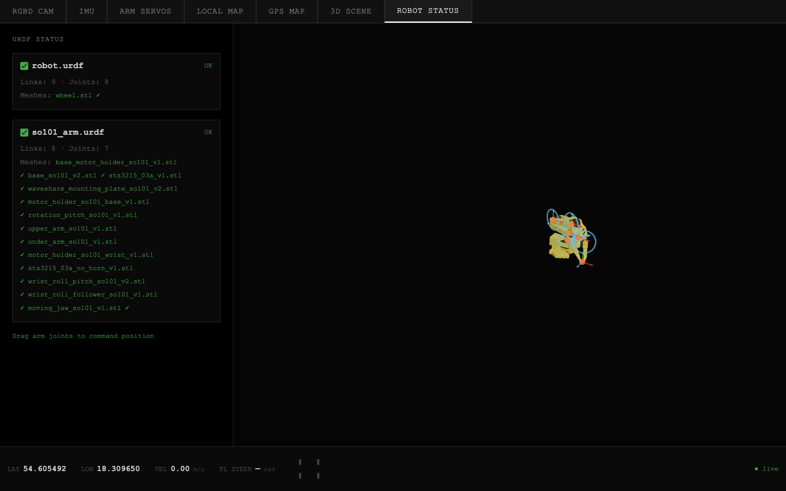
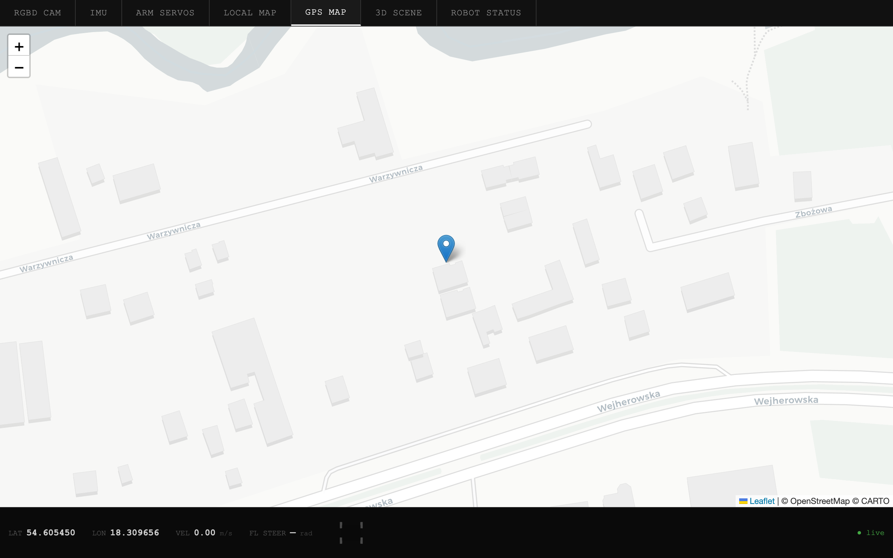
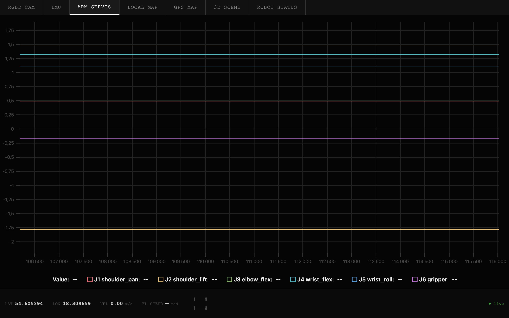
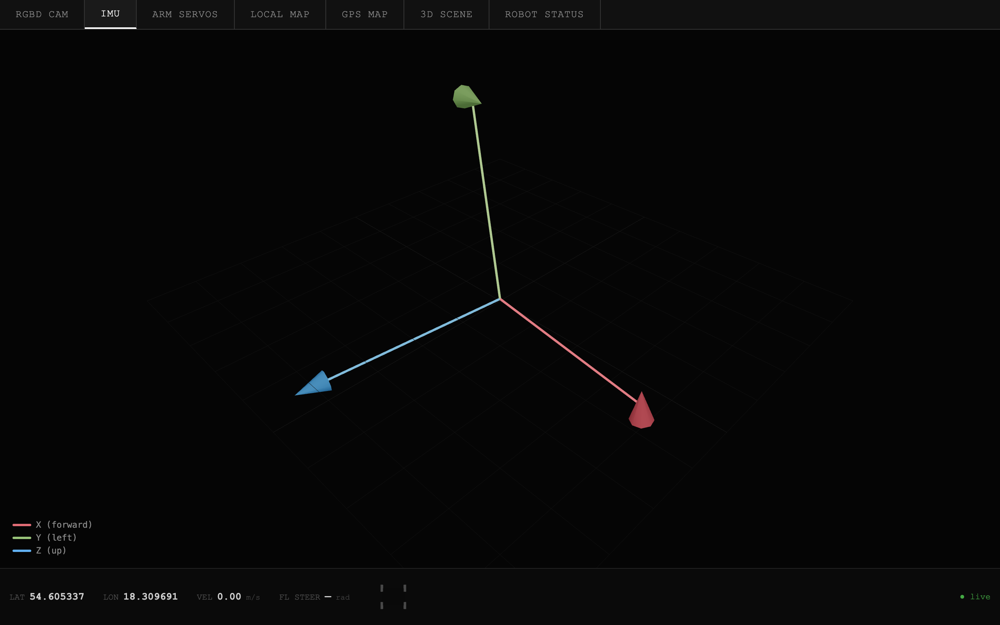
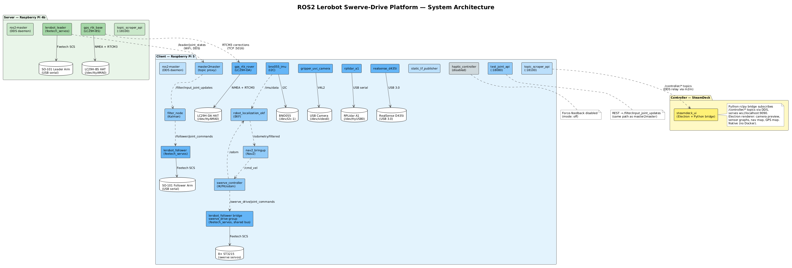
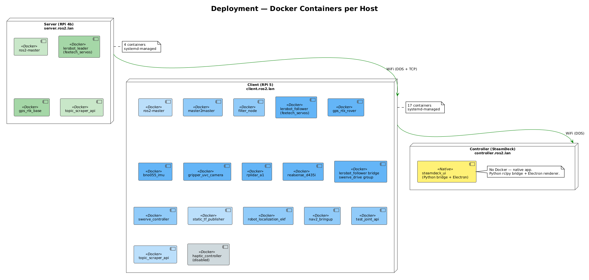
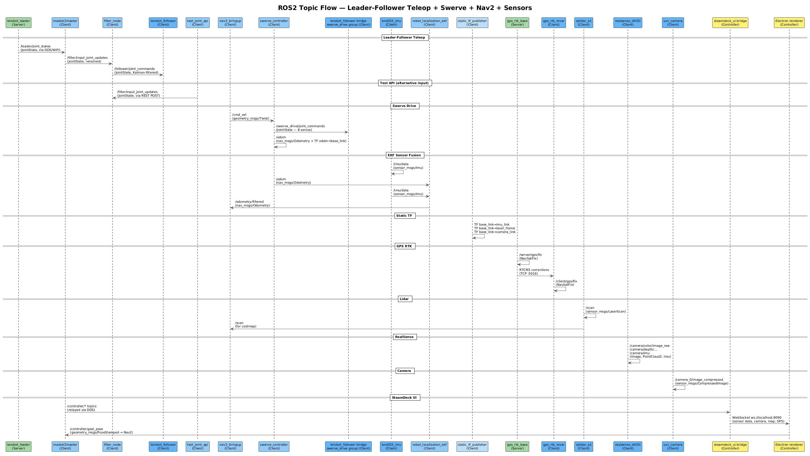

# ROS2 Lerobot Swerve-Drive Platform

A ROS2-based robotics platform with leader–follower teleop, RTK GPS, IMU, cameras, and swerve drive. Two Raspberry Pis (Server + Client) communicate over WiFi, running native ROS2 nodes managed by Ansible and systemd.

## Highlights

<table>
<tr>
<td width="50%">

**Browser-based robot dashboard** — real-time sensor visualization, 3D URDF model, GPS map, and navigation — all from any device on the LAN.

- Live tabs: merged 3D map (SLAM map, costmap, GPS tiles, plans, robot URDF, interactive arm), gripper camera, RGBD camera, IMU
- FastAPI + React + Three.js, served from the onboard RPi
- WebSocket bridge at 20 Hz for all ROS2 topics

</td>
<td width="50%">



</td>
</tr>
<tr>
<td width="50%">



</td>
<td width="50%">

**RTK GPS with sub-meter accuracy** — base station (Server RPi4) broadcasts RTCM3 corrections over TCP to the rover (Client RPi5). Live position on an OpenStreetMap layer with tap-to-navigate.

</td>
</tr>
<tr>
<td width="50%">

**Leader–follower arm teleop** — move the leader SO-101 arm and the follower mirrors in real-time. Kalman-filtered joint commands cross WiFi via DDS with predictive compensation for network delay.

</td>
<td width="50%">



</td>
</tr>
<tr>
<td width="50%">



</td>
<td width="50%">

**Full sensor suite on a Raspberry Pi 5** — BNO055 IMU, RealSense D435i depth camera, RPLidar A1, dual USB cameras, 8-servo swerve drive, and Nav2 navigation stack — all running natively with Poetry venvs and systemd.

</td>
</tr>
</table>

**What makes this project unique:**

- **18 ROS2 nodes** running as native systemd services across two Raspberry Pis — no Docker, no X11, just headless embedded Linux
- **4-wheel swerve drive** with inverse/forward kinematics, odometry, and autonomous navigation via Nav2
- **Zero-touch deployment** — Ansible provisions bare Ubuntu, installs ROS2, deploys nodes, and tunes the OS for real-time performance
- **3D robot visualization** in-browser with URDF model, lidar overlay, and costmap — powered by Three.js and react-three-fiber
- **Telemetry API** — HTTP + WebSocket topic scraper with observation rules for automated health monitoring

## Architecture



<details>
<summary>Deployment view (services per host)</summary>


</details>

<details>
<summary>Topic flow (message sequence)</summary>


</details>

PlantUML sources are in [`docs/diagrams/`](docs/diagrams/). Regenerate with:

```bash
./scripts/generate-diagrams.sh
```

## Implemented features

| Feature | Status | Description |
|---------|--------|-------------|
| Leader–follower teleop | **Working** | 6-DOF arm teleop: leader (Server) → master2master → Kalman filter → follower (Client) |
| GPS RTK positioning | **Working** | LC29H-BS base (Server) + LC29H-DA rover (Client), RTCM3 over TCP, `NavSatFix` topics, sub-meter accuracy |
| IMU | **Working** | BNO055 over I2C, `sensor_msgs/Imu` with Nav2 covariance matrices |
| USB cameras | **Disabled** | UVC camera bridge (present, `enabled: false` while camera unplugged) |
| Topic scraper API | **Working** | Dynamic ROS2 topic discovery + HTTP JSON API for runtime diagnostics |
| Haptic controller | **Disabled** | Force-feedback and zero-G hold for leader gripper (code present, `enabled: false`) |
| Swerve drive | **Working** | 4-wheel swerve: feetech bridge (8 servos) + controller (cmd_vel, FK/IK, odom) |
| RealSense D435i | **Working** | Depth + color + IMU (unified `/camera/imu`) via ros-jazzy-realsense2-camera |
| RPLidar-A1 | **Working** | 2D lidar `sensor_msgs/LaserScan` on `/scan` via ros-jazzy-rplidar-ros |
| Web UI dashboard | **Working** | Browser-based robot dashboard: RGBD cam, IMU 3D, servo graphs, local/GPS map, 3D URDF scene, robot status |
| Nav2 (MVP) | **Working** | 2D nav stack: odom, scan, IMU, goal → cmd_vel; EKF fuses odom+IMU |

## Node catalog

### Server (Raspberry Pi 4b — server.ros2.lan)

| Node | Type | ROS2 Topics | Hardware |
|------|------|-------------|----------|
| `ros2-master` | ros2_master | DDS daemon | — |
| `lerobot_leader` | feetech_servos | `/leader/joint_states` (pub) | SO-101 arm (USB serial) |
| `gps_rtk_base` | gps_rtk | `/server/gps/fix` (pub), RTCM3 TCP :5016 | LC29H-BS HAT (`/dev/ttyAMA0`) |
| `topic_scraper_api` | topic_scraper_api | HTTP :18100 | — |

### Client (Raspberry Pi 5 — client.ros2.lan)

| Node | Type | ROS2 Topics | Hardware |
|------|------|-------------|----------|
| `ros2-master` | ros2_master | DDS daemon | — |
| `master2master` | master2master | Proxies `/leader/joint_states` → `/filter/input_joint_updates` | — |
| `filter_node` | filter_node | `/filter/input_joint_updates`, `/filter/web_ui_joint_commands`, `/filter/autonomy_joint_commands` (sub) → `/follower/joint_commands` (pub); `/filter/autonomy_release` (sub), `/filter/active_source` (pub). Arbitrates sources, priority autonomy > web_ui > leader; the autonomy lease is sticky (no timeout) until released | — |
| `lerobot_follower` | feetech_servos | `/follower/joint_commands` (sub), `/follower/joint_states` (pub) | SO-101 arm (USB serial, shared with the swerve servos) |
| `gps_rtk_rover` | gps_rtk | `/client/gps/fix` (pub), RTCM3 from Server :5016 | LC29H-DA HAT (`/dev/ttyAMA0`) |
| `bno055_imu` | bno055_imu | `/imu/data` (pub, `sensor_msgs/Imu`) | BNO055 (`/dev/i2c-1`) |
| `gripper_uvc_camera` | uvc_camera | `/camera_0/image_raw/compressed` (pub, `sensor_msgs/CompressedImage`) | USB camera |
| `lerobot_follower` (group `swerve_drive`) | feetech_servos | `/swerve_drive/joint_states` (pub), `/swerve_drive/joint_commands` (sub) | 8× ST3215 swerve servos (IDs 32-39) on the follower arm bus |
| `swerve_controller` | swerve_controller | `/cmd_vel` (sub), `/odom` (pub), `/swerve_drive/joint_commands` (pub); TF off (EKF owns odom→base_link) | — |
| `static_tf_publisher` | static_tf_publisher | TF base_link → imu_link, laser_frame | — |
| `robot_localization_ekf` | robot_localization_ekf | `/odom` (sub), `/imu/data` (sub), `/odometry/filtered` (pub), TF odom→base_link | — |
| `slam_toolbox` | slam_toolbox | `/scan` (sub), `/map` (pub), TF map→odom; posegraph in `/var/lib/ros2/maps` | — |
| `nav2_bringup` | nav2_bringup | `/goal_pose` (sub), `/plan`, `/optimal_trajectory` (pub), `/cmd_vel` (pub), `/odometry/filtered`, `/map`, `/scan`, `navigate_to_pose` (action) | — |
| `rplidar_a1` | rplidar_a1 | `/scan` (pub, `sensor_msgs/LaserScan`) | RPLidar A1 (`/dev/ttyUSB0`) |
| `realsense_d435i` | realsense_d435i | `/camera/*` (color, depth, pointcloud, `/camera/imu`) | RealSense D435i (USB 3.0) |
| `test_joint_api` | test_joint_api | REST :18080 → `/filter/input_joint_updates` (pub) | — |
| `topic_scraper_api` | topic_scraper_api | HTTP :18100 | — |
| `web_ui` | web_ui | HTTP :8080, WS `/ws` (20 Hz topic broadcast). Tabs: 3D Map (SLAM map, costmap, GPS tiles, plans, goal, robot URDF, interactive arm), gripper camera, RGBD camera, IMU; calls `/arm/home`, `/arm/set_home` | — |
| `mcp_server` | mcp_server | MCP Streamable HTTP :18200 `/mcp` (bearer token). Tools: robot/arm state, camera images, map summary, `navigate_to_pose` (Nav2 action), `move_relative`, `drive`, `stop`, arm joint/cartesian moves, gripper, arm home. Arm setpoints go to `/filter/autonomy_joint_commands`; serves `/arm/home`, `/arm/set_home`; reads `/camera_0/image_raw/compressed` and `/camera/camera/color/image_raw` | — |
| `haptic_controller` | haptic_controller | Disabled (`mode: off`) | — |

### Topic flow (leader–follower path)

```
Server: lerobot_leader  →  /leader/joint_states
                              ↓ (WiFi / DDS)
Client: master2master   →  /filter/input_joint_updates  ← test_joint_api (REST)
                              ↓
        filter_node     →  /follower/joint_commands (Kalman-filtered)
                              ↓
        lerobot_follower → servos
```

### Topic flow (swerve + SLAM + Nav2)

```
web_ui 3D Map tab (Top view, click+drag)  →  /goal_pose  →  Nav2 bt_navigator
Nav2: planner_server → /plan (global), controller_server MPPI → /optimal_trajectory (local)
      → cmd_vel_nav → velocity_smoother → collision_monitor → /cmd_vel
        swerve_controller → /swerve_drive/joint_commands  →  lerobot_follower bridge, swerve_drive group (8 servos)
        swerve_controller → /odom
robot_localization_ekf fuses /odom + /imu/data → /odometry/filtered + TF odom→base_link
slam_toolbox: /scan + TF → /map + TF map→odom  →  Nav2 global costmap static layer, web_ui 3D Map tab
web_ui 3D Map tab shows /map, the local costmap, GPS tiles (anchor auto-fitted from /client/gps/fix + TF), robot URDF at the TF map→base_link pose, /plan, /optimal_trajectory, /goal_pose; "Save map" → /slam_toolbox/serialize_map
mcp_server (Claude Code via MCP): navigate_to_pose → Nav2 navigate_to_pose action; drive → /cmd_vel_nav
Arm sources: leader (via master2master) | web_ui (/filter/web_ui_joint_commands) | mcp_server (/filter/autonomy_joint_commands, sticky lease)
  → filter_node arbitration (autonomy > web_ui > leader), active source on /filter/active_source
```

## Controlling the robot from Claude Code (MCP)

The `mcp_server` node on the client RPi exposes the robot as MCP tools at `http://client.ros2.lan:18200/mcp`, protected by a bearer token that Ansible generates once on the robot (`/etc/ros2/mcp_server/token`, never in git). The repo-root `.mcp.json` registers it as server `robot` and reads the token from `ROBOT_MCP_TOKEN`:

```bash
eval "$(./scripts/robot_mcp_token.sh)"   # ssh to client.ros2.lan, exports ROBOT_MCP_TOKEN
claude                                   # start Claude Code in this repo, approve the project server "robot"
```

`ROBOT_SSH_TARGET=user@host` overrides the ssh target. Arm motion goes through filter_node's autonomy lease, base motion through Nav2. See [nodes/mcp_server/README.md](nodes/mcp_server/README.md) for the tool list and safety model.

## Hardware components

### Server — Raspberry Pi 4b

- Lerobot SO-101 leader arm (Feetech SCS servos, USB serial)
- GPS-RTK LC29H(BS) HAT with antenna

### Client — Raspberry Pi 5

- Lerobot SO-101 follower arm (Feetech SCS servos, USB serial)
- Swerve drive platform (4 × Feetech ST3215 pairs — wheel + steering)
- GPS-RTK LC29H(DA) HAT with antenna
- BNO055 IMU (I2C)
- RPLidar-A1 (USB)
- Intel RealSense D435i (USB)
- 2 × Arducam B0454 5MP OV5648 USB cameras

### Future

- AI offloading server (x64, LLM/VLA)

## Monorepo layout

```
├── nodes/                  All ROS2 node source + Dockerfiles
│   ├── ros2_master/        DDS daemon
│   ├── master2master/      Cross-host topic proxy
│   ├── lerobot_teleop/     Leader→follower teleop (not deployed; path uses filter_node)
│   ├── filter_node/        Kalman filter for joint commands
│   ├── test_joint_api/     REST API for joint testing
│   ├── topic_scraper_api/  Dynamic topic scraper + HTTP API
│   ├── haptic_controller/  Force-feedback (disabled)
│   ├── swerve_drive_controller/ Swerve IK/FK, odometry, cmd_vel→joints
│   ├── static_tf_publisher/ Static TF base_link→sensors
│   ├── robot_localization_ekf/ EKF fuse odom+IMU
│   ├── nav2_bringup/       Nav2 navigation stack
│   ├── web_ui/             Browser dashboard (FastAPI + React + Three.js)
│   ├── mcp_server/         Robot MCP server for LLM agents (Claude Code)
│   ├── steamdeck_ui/       SteamDeck Electron UI + Python bridge (legacy)
│   └── bridges/
│       ├── bno055_imu/     BNO055 IMU bridge
│       ├── feetech_servos/ Feetech servo bridge (leader + follower)
│       ├── uvc_camera/     UVC camera bridge
│       ├── gps_rtk/        GPS RTK bridge (base + rover)
│       ├── rplidar_a1/     RPLidar A1 LaserScan bridge
│       └── realsense_d435i/ RealSense D435i bridge
├── shared/                 Shared Python libraries
├── ansible/                Provisioning + deployment (Ansible)
│   ├── roles/              common, network, hostname, ros2_base, ros2_node_deploy,
│   │                       ros2_node_verify, system_optimize, monitoring, docker_cleanup
│   ├── playbooks/          Provision + deploy + optimize
│   └── group_vars/         Per-host node lists and config
├── scripts/                Utility scripts (calibration, verification, diagnostics)
├── tests/                  Root-level tests
└── docs/diagrams/          PlantUML sources + generated PNGs
```

## Development setup

- **Python**: Managed with [mise](https://mise.jdx.dev/). Run `mise install` to get Python 3.12, uv, and Poetry.
- **Dependencies**: Root: `mise exec -- poetry install`. Each node has its own Poetry project.
- **Linters**: `poetry run poe lint` (root), `poetry run poe lint-nodes` (all nodes), `poetry run poe lint-ansible` (Ansible).
- **Tests**: `poetry run pytest` (root). Per-node: `cd nodes/<node> && poetry run poe test`.
- **Pre-commit**: `pre-commit install` once, then hooks run on every commit.

## Ansible

From the `ansible/` directory:

```bash
# Full site (provision + optimize + deploy)
ansible-playbook -i inventory site.yml

# Provision only (bootstrap, network, Docker, system optimization)
ansible-playbook -i inventory playbooks/server.yml -l server
ansible-playbook -i inventory playbooks/client.yml -l client

# Deploy nodes only
ansible-playbook -i inventory playbooks/deploy_nodes_server.yml -l server
ansible-playbook -i inventory playbooks/deploy_nodes_client.yml -l client

# System optimization only (debloat, performance, SD card protection)
ansible-playbook -i inventory playbooks/optimize.yml
```

See [ansible/README.md](ansible/README.md) for full details on roles, node config, and variables.

## Documentation index

| Document | Description |
|----------|-------------|
| [ROADMAP.md](ROADMAP.md) | MVP scope and roadmap streams |
| [CLAUDE.md](CLAUDE.md) | Project conventions for AI coding assistants |
| [MEMORY.md](MEMORY.md) | Key decisions and agent notes |
| [ansible/README.md](ansible/README.md) | Ansible playbooks, roles, deployment |
| [nodes/README.md](nodes/README.md) | Nodes overview |
| [nodes/bridges/README.md](nodes/bridges/README.md) | Hardware bridges |
| [tests/README.md](tests/README.md) | Test suite documentation |
| [scripts/README.md](scripts/README.md) | Utility scripts (RTK calibration, verification) |

### Per-node READMEs

| Node | README |
|------|--------|
| ros2_master | [nodes/ros2_master/README.md](nodes/ros2_master/README.md) |
| master2master | [nodes/master2master/README.md](nodes/master2master/README.md) |
| feetech_servos | [nodes/bridges/feetech_servos/README.md](nodes/bridges/feetech_servos/README.md) |
| uvc_camera | [nodes/bridges/uvc_camera/README.md](nodes/bridges/uvc_camera/README.md) |
| gps_rtk | [nodes/bridges/gps_rtk/README.md](nodes/bridges/gps_rtk/README.md) |
| lerobot_teleop | [nodes/lerobot_teleop/README.md](nodes/lerobot_teleop/README.md) |
| filter_node | [nodes/filter_node/README.md](nodes/filter_node/README.md) |
| test_joint_api | [nodes/test_joint_api/README.md](nodes/test_joint_api/README.md) |
| topic_scraper_api | [nodes/topic_scraper_api/README.md](nodes/topic_scraper_api/README.md) |
| bno055_imu | [nodes/bridges/bno055_imu/README.md](nodes/bridges/bno055_imu/README.md) |
| rplidar_a1 | [nodes/bridges/rplidar_a1/README.md](nodes/bridges/rplidar_a1/README.md) |
| realsense_d435i | [nodes/bridges/realsense_d435i/README.md](nodes/bridges/realsense_d435i/README.md) |
| haptic_controller | [nodes/haptic_controller/README.md](nodes/haptic_controller/README.md) |
| swerve_drive_controller | [nodes/swerve_drive_controller/README.md](nodes/swerve_drive_controller/README.md) |
| static_tf_publisher | [nodes/static_tf_publisher/README.md](nodes/static_tf_publisher/README.md) |
| robot_localization_ekf | [nodes/robot_localization_ekf/README.md](nodes/robot_localization_ekf/README.md) |
| nav2_bringup | [nodes/nav2_bringup/README.md](nodes/nav2_bringup/README.md) |
| web_ui | [nodes/web_ui/README.md](nodes/web_ui/README.md) |
| mcp_server | [nodes/mcp_server/README.md](nodes/mcp_server/README.md) |
| steamdeck_ui | [nodes/steamdeck_ui/README.md](nodes/steamdeck_ui/README.md) |
